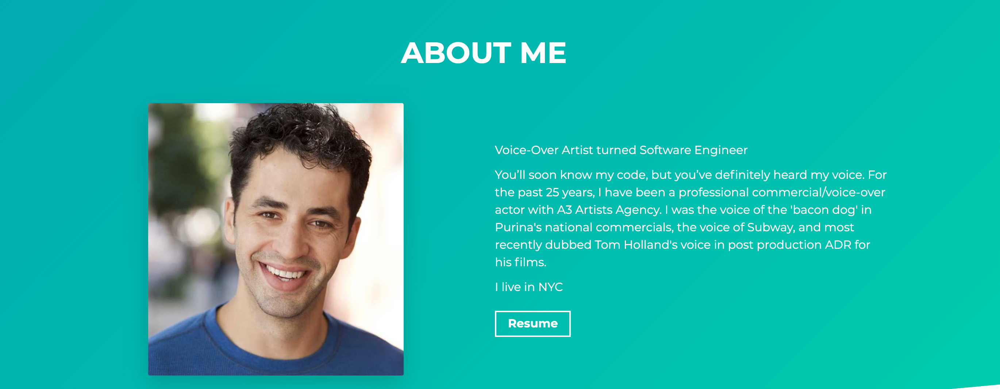

## David Kremenitzer's Software Engineering Portfolio

## Portfolio Projects 2021

- Blocks - A globally encrypted file sharing platform
- Amazon-Clone
- ERC-20 Token on the Ethereum Network
- Coinbase Clone
- Commercial/VO Portfolio

## Technologies used 🛠️

- React
- Gatsby
- GraphQL
- SCSS
- Bootstrap

## Author

- David Kremenitzer - [https://github.com/Davidkrem](https://github.com/Davidkrem)

### Live Demo

https://www.davidkrem.tech/
